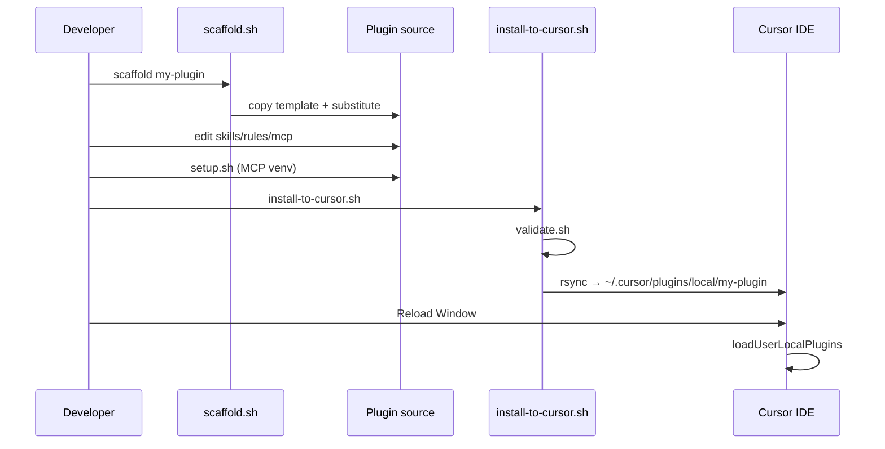

# Architecture

## Repository roles

```text
cursor-plugin/          ← this repo (tooling + template)
├── scaffold.sh         ← copies template/ → new plugin repo
└── template/           ← canonical skeleton

my-plugin/              ← generated or hand-written plugin
├── .cursor-plugin/plugin.json
├── scripts/            ← setup, install, validate
└── [skills|rules|hooks|mcp]/
```

## Install flow



## Script responsibilities

| Script | Input | Output |
|--------|-------|--------|
| `lib/common.sh` | `plugin.json` | `plugin_name`, paths, python finder |
| `setup.sh` | `mcp/requirements.txt` | `mcp/.venv`, `.mcp.json` |
| `generate-mcp-config.sh` | venv paths | `.mcp.json` |
| `validate.sh` | plugin tree | exit 0/1 |
| `install-to-cursor.sh` | source tree | installed copy + optional setup |

## Cursor load path

1. Scan `~/.cursor/plugins/local/*/` (non-symlink dirs).
2. Read `.cursor-plugin/plugin.json`.
3. Register skills, rules, hooks, MCP from manifest paths.
4. MCP loads `.mcp.json` relative to plugin root.

## Extension points for new plugin types

| Add | Steps |
|-----|-------|
| New MCP tools | Edit `mcp/server.py`, run setup |
| New skill | Add `skills/<name>/SKILL.md` |
| New rule | Add `rules/<name>.mdc` |
| New hook event | Extend `hooks/hooks.json` + script |
| Vendor lib | `vendor/` + `mcp/post-setup.sh` + install rsync |
| CI | Call `validate.sh`, `smoke-test-mcp.py` |

## Design decisions

1. **Single template** with component flags — simpler than multiple templates.
2. **Python for JSON** in shell scripts — no `jq` dependency.
3. **rsync excludes** centralized in `common.sh`.
4. **Generated `.mcp.json`** — absolute paths required by Cursor MCP loader.
5. **Placeholder substitution** in scaffold — no templating engine dependency.
